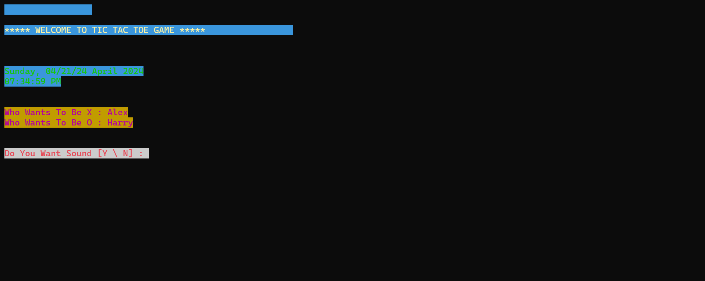
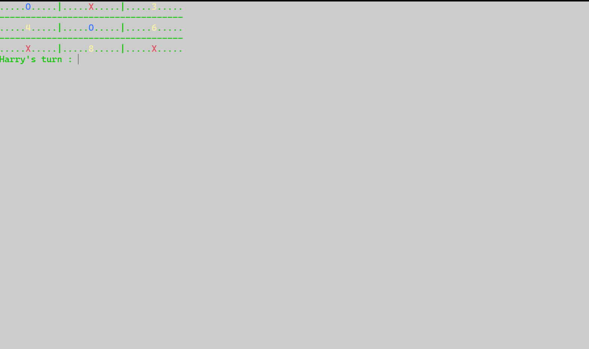

# Tic-Tac-Toe-Game

This is a Tic Tac Toe Game built in Python. It is a two player game which you can play with your friends. It has two versions - Simple and Advanced. Ofcourse the advanced one is made by modifying the simple one. There is also the executable file in case you don't have Python.

The Advanced Tic Tac Toe contains the following features - 
- It shows date and time.
- It has colors in it.
- It can speak and great users.
- It can congratulate and ask if you want to replay.

Following modules has been used in building it :-
- #### time 
    To show time and date.
- #### sys And subprocess
    For performing actions related to terminals.
- #### colorama
    For adding colors.
- #### pyttsx3
    For adding speech in the game.
- #### pyinstaller
    For converting .py file to .exe file.

For .exe file to work, you should have following software depending upon your operating system (These are generally present in your system):

- ##### sapi5 :
    For Windows
- ##### nssss :
    For MacOS
- ##### espeak :
    For Linux
